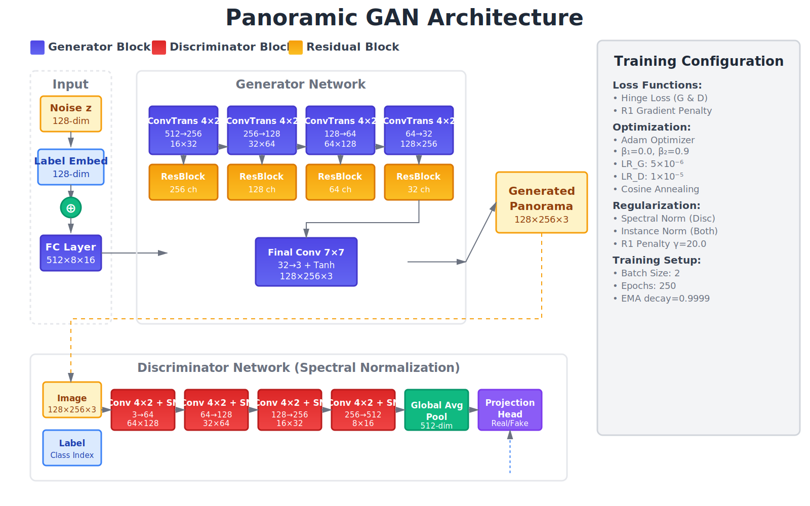

# Panoramic Scene Generation using Conditional GAN

[](https://opensource.org/licenses/Apache-2.0)

*Generating Seamless 360° Panoramic Images across Multiple Scene Categories*

## Abstract
This repository presents a Conditional Generative Adversarial Network (GAN) for generating panoramic images (128×256 resolution) across three distinct scene categories: city, forest, and rural. The model achieves competitive performance, with an FID of 70.04 and an Inception Score of 2.65, on a challenging dataset of 25,934 panoramic images. Key contributions include systematic hyperparameter optimization to overcome mode collapse during training, a progressive fine-tuning strategy spanning 250 epochs, and careful loss balancing through the use of spectral normalization and gradient penalties.

## Table of Contents
- [Introduction](#introduction)
- [Architecture](#architecture)
- [Dataset](#dataset)
- [Training Methodology](#training-methodology)
- [Results](#results)
- [Installation](#installation)

---

## Introduction
Panoramic image generation poses unique challenges:

- **Wide field of view:** 2:1 aspect ratio with diverse spatial elements
- **Multi-scale structure:** Requires capturing both foreground and background
- **Class imbalance:** Real-world datasets often have uneven class distributions

This work addresses these challenges through:

- Custom GAN architecture optimized for 2:1 aspect ratio (128×256)
- Progressive training strategy with careful discriminator-generator balance
- Class-conditional generation using projection discriminator
- Exponential Moving Average (EMA) for stable convergence

---

## Architecture

### Network Overview



The architecture consists of two main components:

### Generator Network
**Input:** [Noise(128-dim) + Class Embedding(128-dim)] → 256-dim

The generator uses progressive upsampling with residual connections:

1. **Fully Connected Layer:** 256 → 512×8×16
2. **Stage 1:** ConvTranspose2d (512→256, k=4, s=2, p=1) + ResBlock(256) → 16×32
3. **Stage 2:** ConvTranspose2d (256→128, k=4, s=2, p=1) + ResBlock(128) → 32×64
4. **Stage 3:** ConvTranspose2d (128→64, k=4, s=2, p=1) + ResBlock(64) → 64×128
5. **Stage 4:** ConvTranspose2d (64→32, k=4, s=2, p=1) + ResBlock(32) → 128×256
6. **Final Layer:** Conv2d (32→3, k=7, s=1, p=3) + Tanh → Output RGB (128×256×3)

**Key Components:**
- Residual blocks with Instance Normalization (Conv → InstanceNorm → ReLU) for improved gradient flow
- Progressive upsampling architecture
- Class-conditional generation via embedding

### Discriminator Network
**Input:** RGB Image (3×128×256) + Class Label

The discriminator uses spectral normalization throughout:

1. **Stage 1:** Conv2d + SN (3→64, k=4, s=2, p=1) + LeakyReLU(0.2) → 64×128
2. **Stage 2:** Conv2d + SN (64→128, k=4, s=2, p=1) + InstanceNorm + LeakyReLU(0.2) → 32×64
3. **Stage 3:** Conv2d + SN (128→256, k=4, s=2, p=1) + InstanceNorm + LeakyReLU(0.2) → 16×32
4. **Stage 4:** Conv2d + SN (256→512, k=4, s=2, p=1) + InstanceNorm + LeakyReLU(0.2) → 8×16
5. **Global Average Pooling:** 512×8×16 → 512-dim
6. **Projection Head:** Linear(512→1) + Class Embedding(512-dim) → Real/Fake Score

**Key Components:**
- Spectral normalization for Lipschitz constraint (applied to all Conv layers)
- Instance normalization in stages 2-4 
- Projection discriminator for class conditioning
- Multi-scale feature extraction
- R1 gradient penalty for regularization

---

## Dataset

### Structure and Statistics
```
Proprietary Panoramic Dataset
├── city/      8,739 images  (33.7%)
├── forest/    1,591 images  (6.1%)
└── rural/     15,604 images (60.2%)
─────────────────────────────────────
Total:         25,934 panoramic images
```

**Note:** The dataset used in this work is proprietary and cannot be publicly shared due to licensing and privacy restrictions. However, the code is fully functional and can be used with your own panoramic image dataset organized in the same structure.

### Dataset Characteristics
| Property | Value |
|----------|-------|
| Total Images | 25,934 |
| Original Resolution | 832×416 pixels (2:1 aspect ratio) |
| Training Resolution | 128×256 pixels (downsampled) |
| Format | JPEG/PNG |
| Scene Types | City, Forest, Rural |

### Data Split
The dataset was split into:
- **Training Set:** 80% (20,747 images)
- **Validation Set:** 20% (5,187 images)

### Evaluation Protocol
**Evaluation was performed on the validation set:**
- Generated samples: 1,000 images per model
- Real validation samples: 1,000 randomly sampled from validation set
- No overlap between training and evaluation data
- FID and IS calculated using Inception-v3 features

### Class Distribution Analysis

**City (8,739 images - 33.7%)**
- Urban streets and buildings
- Varied conditions: blurred vehicles, blurred buildings, tunnel interiors
- Diverse lighting and weather conditions

**Forest (1,591 images - 6.1%)**
- Natural forest landscapes
- Limited diversity: majority similar forest paths
- ~25-30% contain rural elements (not pure forest)
- Smallest class - potential for class imbalance effects

**Rural (15,604 images - 60.2%)**
- Countryside and rural scenes
- Largest class - model shows strongest convergence on this category
- Dominant class influences generation distribution

### Data Preprocessing
Applied transforms during training:
```python
transforms.Compose([
    transforms.Resize((128, 256), Image.LANCZOS),  # Downscale from 416×832
    transforms.RandomHorizontalFlip(p=0.5),
    transforms.ColorJitter(brightness=0.1, contrast=0.1, 
                          saturation=0.1, hue=0.05),
    transforms.ToTensor(),
    transforms.Normalize([0.5, 0.5, 0.5], [0.5, 0.5, 0.5])  # [-1, 1]
])
```

---

## Training Methodology

### Phase 1: Initial Training (Epochs 1-110)
**Configuration:**
```python
lr_g = 1.5e-4
lr_d = 2.0e-4
batch_size = 4
r1_gamma = 12.0
ema_decay = 0.995
```

**Challenge Encountered:**
Generator losses became continuously negative after epoch 75, indicating risk of mode collapse.

**Solution:**
Reduced learning rates by 3-5× to stabilize training dynamics.

### Phase 2: Stability Optimization (Epochs 110-200)

**Version 1 (Epochs 110-130): Initial Stabilization**
```python
lr_g = 5e-5    # ↓ 3× reduction
lr_d = 1e-4    # ↓ 2× reduction
ema_decay_later = 0.9995
```

**Version 2 (Epochs 130-170): Detail Enhancement**
```python
lr_g = 2e-5
lr_d = 5e-5
r1_gamma = 12.0
ema_decay_later = 0.9998
```

**Version 3 (Epochs 170-200): Final Fine-tuning**
```python
lr_g = 1e-5
lr_d = 2e-5
r1_gamma = 15.0
ema_decay_later = 0.9999
```

**Training Losses at Epoch 200:**
- Discriminator Loss: 1.9088 (healthy range)
- Generator Loss: 0.4778 (stable convergence)

### Phase 3: Extended Training (Epochs 200-250)
**Configuration:**
```python
lr_g = 5e-6    # Ultra-conservative
lr_d = 1e-5
r1_gamma = 20.0
```

**Outcome:**
Marginal improvements observed. Checkpoint_200 selected as optimal based on evaluation metrics.

### Loss Functions

**Adversarial Loss (Hinge Loss):**
```python
L_D = 𝔼[max(0, 1 - D(x_real))] + 𝔼[max(0, 1 + D(G(z)))]
L_G = -𝔼[D(G(z))]
```

**R1 Gradient Penalty:**
```python
L_R1 = (γ/2) · 𝔼[||∇D(x_real)||²]
```

**Total Discriminator Loss:**
```python
L_D_total = L_D + λ_R1 · L_R1
```

### Training Infrastructure
| Component | Specification |
|-----------|--------------|
| GPU | NVIDIA Tesla P100 (16GB VRAM) |
| Framework | PyTorch 2.6.0 |
| CUDA | 12.4 |
| cuDNN | 9.3.0 |
| Python | 3.11.13 |
| Batch Size | 2-4 (GPU memory constrained) |
| Optimizer | Adam (β₁=0.0, β₂=0.9) |

---

## Results

### Quantitative Evaluation
| Model | FID ↓ | Inception Score ↑ | Training Epochs |
|-------|-------|-------------------|-----------------|
| EMA_Generator_200 | **70.04** | **2.652 ± 0.139** | 200 |
| Checkpoint_200 | 70.60 | 2.602 ± 0.085 | 200 |
| EMA_Generator_250 | 71.04 | 2.696 ± 0.147 | 250 |
| Checkpoint_250 | 72.28 | 2.607 ± 0.125 | 250 |

**Evaluation Protocol:**
- Generated samples: 1,000 images per model
- Real validation samples: 1,000 randomly sampled from validation set
- FID: Inception-v3 features, Fréchet distance (Heusel et al., NIPS 2017)
- IS: 10 splits for statistical robustness (Salimans et al., NIPS 2016)

### Best Model Analysis

**EMA_Generator_200 (Recommended)**

**Strengths:**
- ✅ Lowest FID score (70.04) - best distribution match
- ✅ Competitive Inception Score (2.65) - good quality/diversity
- ✅ Optimal training convergence at 200 epochs
- ✅ EMA smoothing provides stable outputs

**Performance Metrics:**
```
FID Score: 70.04  (Lower is better)
  → Measures distribution similarity with validation images
  → Competitive for panoramic generation

Inception Score: 2.652 ± 0.139  (Higher is better)
  → Evaluates object recognizability and diversity
  → Confidence interval: [2.513, 2.791]
```

### Class-Specific Performance
Due to imbalanced dataset (Rural: 60%, City: 34%, Forest: 6%):

**Expected Behavior:**
- Model shows strongest convergence on rural scenes (largest class)
- City scenes: Good diversity despite varied conditions
- Forest scenes: Limited by small dataset size (1,591 images)

---

## Installation

### Requirements

**Recommended Hardware:**
- GPU: NVIDIA GPU with 12GB+ VRAM (GTX 1080 Ti / RTX 3060 or better)
- RAM: 16GB+ system memory

**Software Used:**
- Python 3.11.13
- CUDA 12.4
- PyTorch 2.6.0

### Setup Instructions

#### 1. Install PyTorch (GPU)
For CUDA 12.4:
```bash
pip install torch==2.6.0+cu124 torchvision==0.21.0+cu124 \
  --index-url https://download.pytorch.org/whl/cu124
```

#### 2. Install Other Dependencies
```bash
pip install -r requirements.txt
```

---

## Usage

### Preparing Your Own Dataset

Since the original dataset is not publicly available, you'll need to prepare your own panoramic image dataset. Organize images in this structure:

```
your_dataset/
├── city/
│   ├── image001.jpg
│   ├── image002.jpg
│   └── ...
├── forest/
│   ├── image001.jpg
│   └── ...
└── rural/
    ├── image001.jpg
    └── ...
```

**Requirements for your dataset:**
- Images should have a 2:1 aspect ratio (e.g., 832×416, 1024×512, etc.)
- Minimum recommended: 1000+ images per class
- Organize into class-specific folders
- Supported formats: JPEG, PNG

**Data Split Recommendation:**
- 80% training, 20% validation split
- Sample 1,000 images from validation for FID/IS evaluation

### Training

#### Split Dataset (Required - First Time Only)

Before training, you must split your dataset into train/validation sets:
```bash
python train.py \
  --root /path/to/your_dataset \
  --split_dataset \
  --train_ratio 0.8
```

**What this does:**
- Creates `split_info.json` in your dataset directory
- Splits data into 80% training / 20% validation
- Records which specific images belong to train vs validation

**You only run this once.** All subsequent training and evaluation will use this split.

#### Basic Training
```bash
python train.py \
  --root /path/to/your_dataset \
  --out ./outputs \
  --epochs 200 \
  --batch_size 4 \
  --lr_g 1e-5 \
  --lr_d 2e-5
```

#### Monitor Training
Samples are saved every 500 batches to `outputs/`:
- `panorama_epoch_XXX.png` - Per-epoch samples
- `sample_epochX_batchY.png` - During-training samples

### Advanced Training Options

**For Limited GPU Memory (8GB):**
```bash
python train.py \
  --root /path/to/dataset \
  --batch_size 2 \
  --epochs 200
```

**For Faster Convergence (Powerful GPU):**
```bash
python train.py \
  --root /path/to/dataset \
  --batch_size 6 \
  --lr_g 2e-5 \
  --lr_d 4e-5 \
  --epochs 200
```

**Progressive Training (Recommended):**
```bash
# Phase 1: Initial training (epochs 1-110)
python train.py --root /path/to/dataset --epochs 110 --lr_g 1.5e-4 --lr_d 2e-4

# Phase 2: Stability (epochs 110-200)
python train.py --resume ./outputs/checkpoints/checkpoint_epoch_110.pt --epochs 200 --lr_g 1e-5 --lr_d 2e-5

# Phase 3: Fine-tuning (epochs 200-250)
python train.py --resume ./outputs/checkpoints/checkpoint_epoch_200.pt --epochs 250 --lr_g 5e-6 --lr_d 1e-5
```

### Evaluation
```bash
python evaluate.py \
  --model_dir ./outputs/checkpoints \
  --dataset_path /path/to/dataset \
  --output_dir ./evaluation_results \
  --num_samples 1000 \
  --use_validation
```

**What it does:**
- Automatically discovers all `.pt` and `.pth` model files in `--model_dir`
- Evaluates each model found
- Generates FID and Inception Score for each
- Saves comparative results

**Outputs:**
- `detailed_results_TIMESTAMP.json` - Full metrics
- `summary_results_TIMESTAMP.csv` - Summary table
- `MODEL_NAME_samples.png` - Generated samples

### Image Generation
```bash
python generate.py \
  --model outputs/final_generator_ema.pth \
  --num_images 25 \
  --class_type city \
  --output_dir ./generated
```

**Model File Types:**
- **`.pth` files** (recommended): Direct model weights
  - `final_generator_ema.pth` - EMA-smoothed generator (best quality)
  - `final_generator.pth` - Regular generator
  
- **`.pt` files**: Full training checkpoints
  - `checkpoint_epoch_200.pt` - Contains generator, discriminator, optimizers
  - Script automatically loads EMA generator if available, otherwise regular generator

**Class Options:**
- `city` - Urban streets and buildings
- `forest` - Natural forest landscapes  
- `rural` - Countryside and rural scenes

**Output:**
- Grid image: `./generated/city_generated.png` (25 images in 5×5 layout)

---

## Citation

```bibtex
@misc{sahoo2025panoramic,
  author       = {Sahoo, Anshuman and Chamola, Vinay},
  title        = {PanoramicGAN: Conditional GAN for Panoramic Scene Generation},
  year         = {2025},
  publisher    = {GitHub},
  howpublished = {\url{https://github.com/Anshuman047/PanoramicGAN}}
}
```

## 📄 License

This project is licensed under the Apache License 2.0 - see the [LICENSE](LICENSE) file for details.

### What This Means:
- ✅ **You can** use this code for commercial and non-commercial purposes
- ✅ **You can** modify and distribute this code
- ✅ **You must** include the license and copyright notice
- ✅ **You must** state significant changes made to the code
- ✅ **Patent grant** is included - contributors grant patent rights to users

For more information, see the [Apache License 2.0](https://www.apache.org/licenses/LICENSE-2.0).
